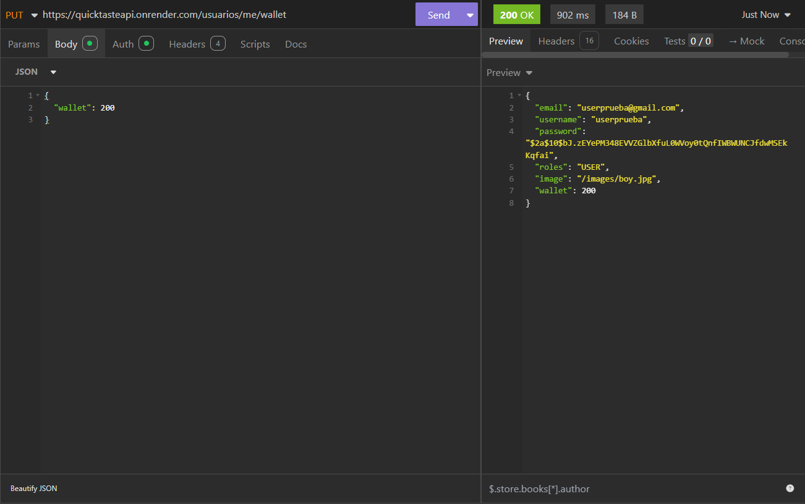
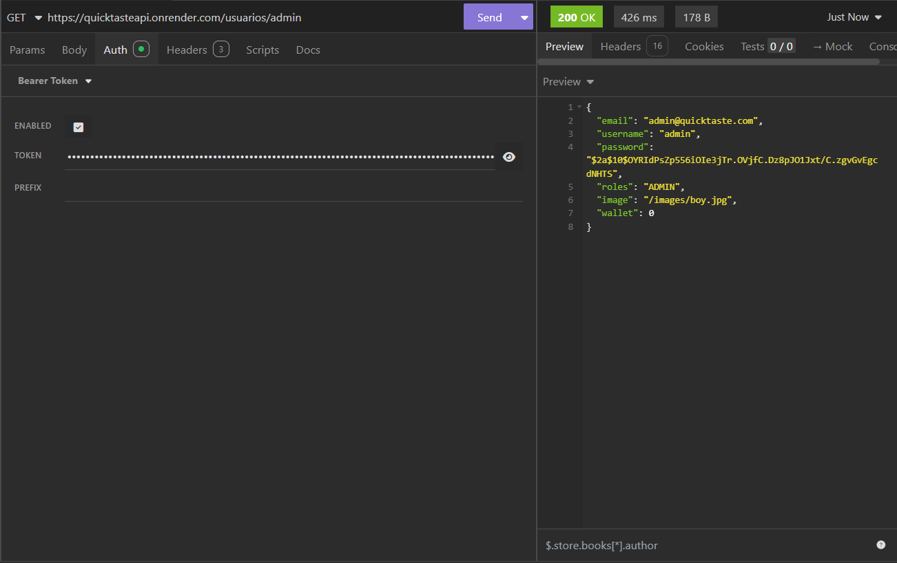

# API REST Segura - quicktasteAPI

## Información General

### a. Nombre del Proyecto
API REST Segura - TareasHogarAPI

### b. Descripción de los Documentos (Entidades) y sus Campos

## b. Descripción de los Documentos (Entidades) y sus Campos

#### Usuario
- **email:** Cadena única que identifica al usuario.
- **username:** Cadena única que identifica al usuario.
- **password:** Contraseña hasheada.
- **roles:** Rol(es) asignados al usuario (por ejemplo, USER o ADMIN).
- **wallet:** Saldo en la cartera del usuario.
- **Campos opcionales:** image (URL de la imagen de perfil).

#### Categoria
- **name:** Identificador único de la categoría.
- **image:** URL de la imagen que representa la categoría.

#### Producto
- **name:** Identificador único del producto.
- **category:** Categoría a la que pertenece el producto.
- **stock:** Cantidad disponible en inventario.
- **description:** Descripción detallada del producto.
- **price:** Precio unitario del producto.
- **image:** URL de la imagen del producto.
- **allowedEmails:** Lista de emails de usuarios autorizados para ver el producto.

#### Pedido
- **id:** Identificador único del pedido.
- **userEmail:** Email del usuario que realizó el pedido.
- **productos:** Lista de nombres de productos solicitados.
- **cantidad:** Cantidad total de productos en el pedido.
- **coste:** Coste total del pedido.
- **direccion:** Dirección de entrega proporcionada por el usuario.
- **status:** Estado actual del pedido (PENDING o DELIVERED).

---

## Lógica de Negocio

### Usuarios
- **Registro**
  - `POST /usuarios/register` → crea un usuario validando que `password` y `passwordRepeat` coincidan.
  - La contraseña se hashea antes de persistir.
  - Responde `201 Created` con el `UsuarioDTO` (sin contraseña).
- **Login**
  - `POST /usuarios/login` → autentica con `username`/`password`.
  - Credenciales inválidas lanzan `ForbiddenException`.
  - Genera y devuelve un JWT + el `UsuarioDTO`.
- **Perfil propio**
  - `GET /usuarios/me` → devuelve el `UsuarioDTO` del usuario autenticado.
  - `PUT /usuarios/me/wallet` → actualiza sólo el campo `wallet`; si falta lanza `BadRequestException`.
- **ADMIN vs USER**
  - **ADMIN** (`ROLE_ADMIN`):
    - `GET /usuarios` → lista todos los usuarios.
    - `GET|PUT|DELETE /usuarios/{username}` → ver, editar o borrar cualquier usuario.
  - **USER**:
    - Sólo puede ver/editar/borrar su propio recurso; intentos sobre otros devuelven `ForbiddenException`.
- **Actualizar wallet de otro**
  - `PUT /usuarios/{username}/wallet` → actualiza `wallet` de cualquier usuario (sin JWT).

### Categorías
- **Consulta**
  - `GET /categorias` → lista todas las categorías.
  - `GET /categorias/{name}` → devuelve una categoría por nombre.
- **Sólo ADMIN**
  - `POST /categorias` → crea nueva categoría (`201 Created`).
  - `PUT /categorias/{name}` → actualiza la imagen (`200 OK`).
  - `DELETE /categorias/{name}` → elimina categoría (`204 No Content`).
  - **USER** recibe `403 Forbidden` al intentar crear/editar/borrar.

### Productos
- **Consulta (USER o ADMIN, JWT)**
  - `GET /productos` → lista todos productos.
  - `GET /productos/{name}` → uno por nombre.
  - `GET /productos/categoria/{category}` → filtra por categoría.
- **ADMIN sólo**
  - `POST /productos` → crea producto (`201 Created`).
  - `PUT /productos/{name}` → actualiza completo (`200 OK`).
  - `DELETE /productos/{name}` → borra (`204 No Content`).
- **Actualizaciones parciales**
  - `PUT /productos/{name}/stock` → recibe `{ "stock": Int }`; falta → `BadRequestException`.
  - `PUT /productos/{name}/price` → recibe `{ "price": Double }`; falta → `BadRequestException`.
  - `PUT /productos/{name}/image` → recibe `{ "image": String }`; falta → `BadRequestException`.
- **Productos permitidos**
  - `GET /productos/allowed` →
    1. Extrae `username` del JWT.
    2. Busca email con `usuarioService.findByUsername(username)`.
    3. Devuelve `productoService.findAllowedForUser(email)`.

### Pedidos
- **Listar**
  - `GET /pedidos` →
    - **ADMIN**: `findAll()` (todos).
    - **USER**: `findByUserEmail(auth.name)` (sólo sus pedidos).
- **Ver uno**
  - `GET /pedidos/{id}` →
    - **ADMIN**: puede ver cualquiera.
    - **USER**: sólo si `dto.userEmail == auth.name`; sino `ForbiddenException`.
- **Crear**
  - `POST /pedidos` →
    - **USER**: ignora `userEmail` del body y usa `auth.name`.
    - **ADMIN**: puede especificar `userEmail`.
    - Siempre limpia `id` a `null`.
    - Responde `201 Created`.
- **Actualizar**
  - `PUT /pedidos/{id}` →
    - Verifica propietario o ADMIN; si no, `ForbiddenException`.
    - **USER**: sólo cambia campos distintos de `status`; fuerza `status` al existente.
    - **ADMIN**: sólo permite `PENDING ↔ DELIVERED`; otro → `BadRequestException`.
- **Eliminar**
  - `DELETE /pedidos/{id}` →
    - Sólo ADMIN o propietario; si no, `ForbiddenException`.

### Validaciones y Errores
- `BadRequestException` para cuerpos inválidos o campos faltantes.
- `ForbiddenException` para accesos no autorizados.
- Login fallido → `ForbiddenException("Invalid credentials")`.

---

## Manejo de Excepciones y Códigos de Estado

- **400 Bad Request:**  
  Se retorna cuando la solicitud tiene errores en los datos enviados o está mal formada.

- **401 Unauthorized:**
  Se utiliza cuando el usuario no está autenticado o el token JWT es inválido o ha expirado.

- **403 Forbidden:**
  Se devuelve cuando el usuario autenticado intenta acceder a un recurso o realizar una acción para la cual no tiene permisos (por ejemplo, un usuario intentando eliminar una tarea de otro usuario)

- **404 Not Found:**  
  Se emplea cuando se solicita un recurso que no existe (por ejemplo, una tarea o usuario inexistente).

- **500 Internal Server Error:**  
  Se utiliza para errores inesperados en el servidor.

---

## Restricciones de Seguridad

### Autenticación y Autorización
- Se utiliza Spring Security con JWT para proteger los endpoints.
- Los tokens se firman con clave privada y se validan con clave pública.

### Control de Acceso a Endpoints
- Endpoints de autenticación (`/usuarios/register`, `/usuarios/login`) accesibles sin JWT.
- Todos los demás endpoints requieren un JWT válido en la cabecera `Authorization: Bearer <token>`.
- Rol `USER`: solo puede acceder y modificar sus propios recursos (usuarios, pedidos, productos permitidos).
- Rol `ADMIN`: puede acceder y modificar todos los recursos (usuarios, categorías, productos, pedidos).

### Validación y Auditoría
- Validaciones en servidor garantizan datos válidos y completos; campos faltantes lanzan `BadRequestException`.
- Intentos de acceso no autorizado generan `ForbiddenException` y se registran en logs para auditoría.

---

## PRUEBAS GESTIÓN USUARIOS

## PRUEBAS GESTIÓN CATEGORÍAS

## PRUEBAS GESTIÓN PRODUCTOS

## PRUEBAS GESTIÓN PEDIDOS

## TESTS JUnit

---